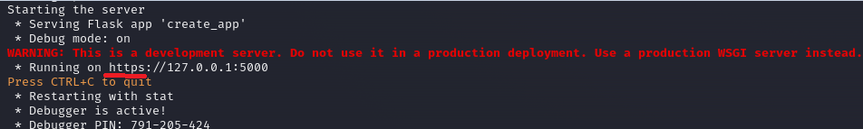
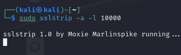
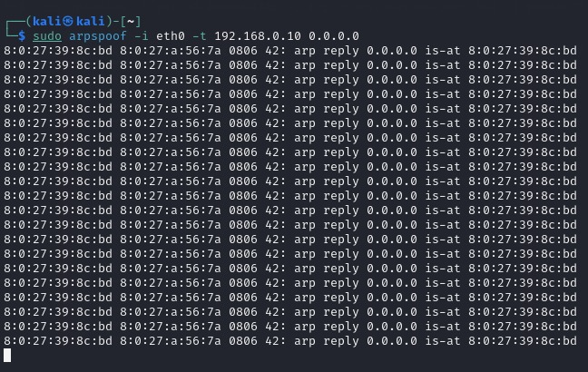
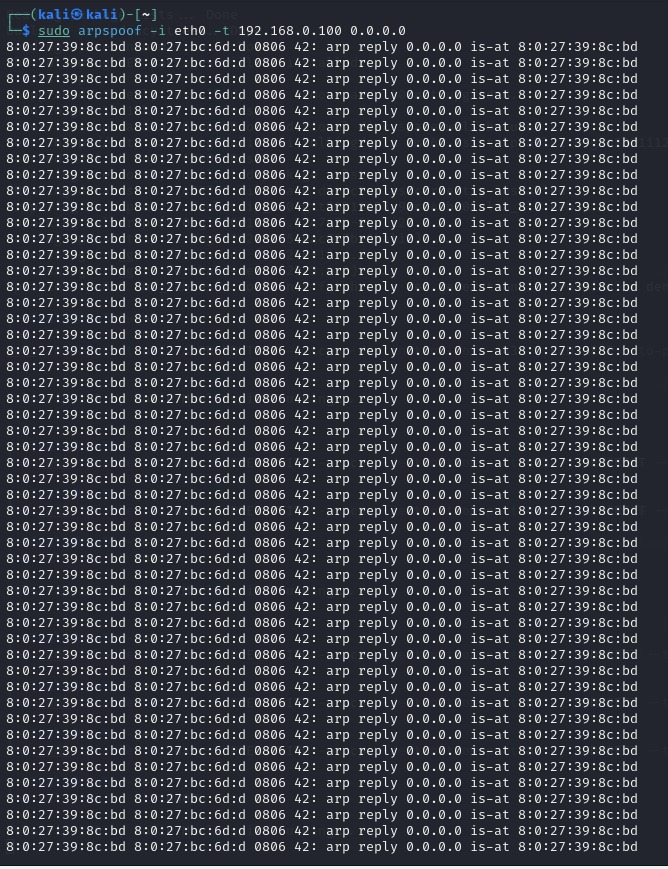
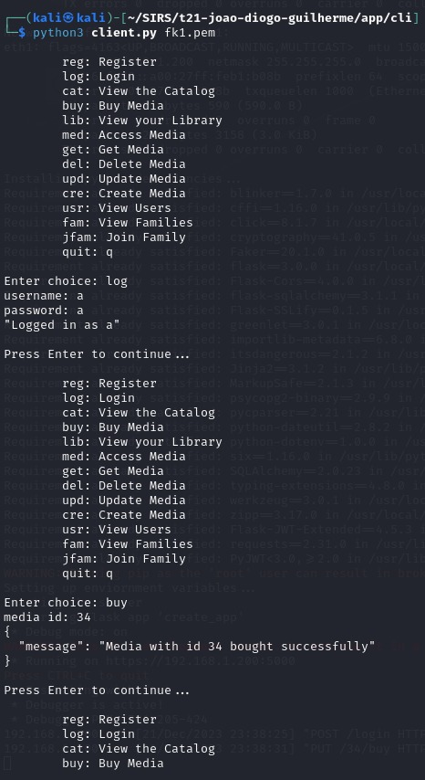
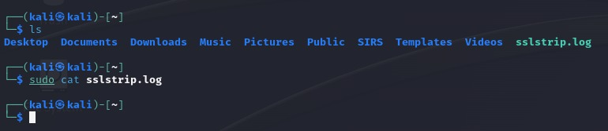
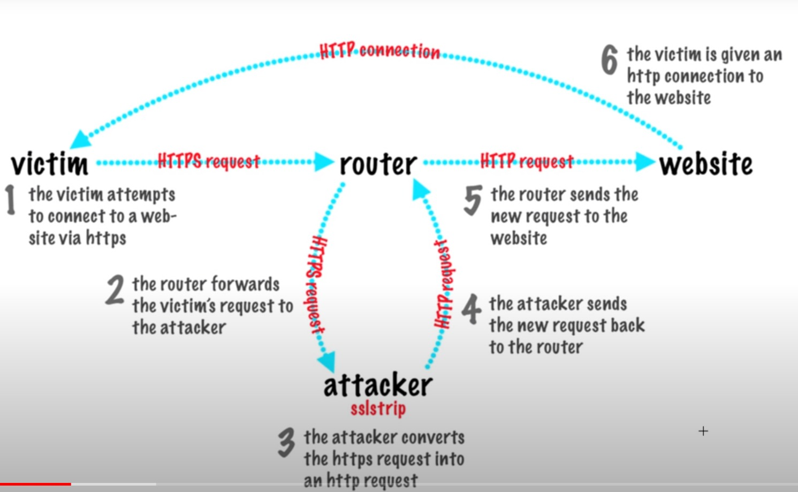
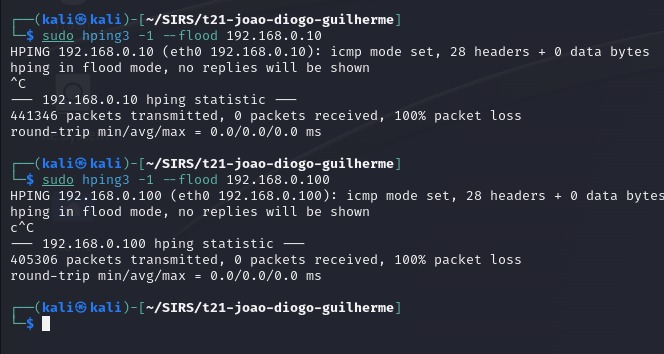
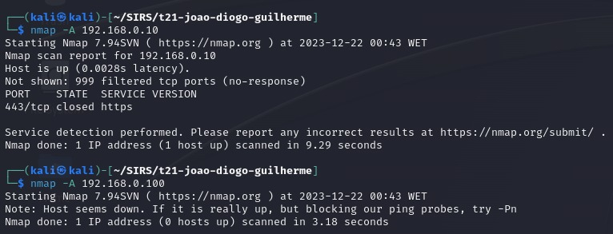

# T21 GrooveGalaxy Project Report

## 1. Introduction
### 1.1 Secure Documents (Safe Sound)
The SafeSound library provides a command-line interface for performing cryptographic operations on media documents. It handles encryption, decryption, and integrity verification.

<ul>
 <li>
  protect: Encrypts the audio content of a media document using AES cipher with CFB and a mix of timestamp and a random number to guarantee freshness.
 </li>
 <li>
  unprotect: Decrypts the audio content of an encrypted media document.
 </li>
 <li>
  check: Verifies the integrity of a media document by checking the timestamp, random number, and hash:

  * The hash of the document received will be computed and compared to the hash stored in the document. If both hashes are the same, then the file was not changed.
  * A window of 5 seconds is used on the timestamp a document is only accepted in that window. Also, if the server receives two documents with the same random number, this indicates a replay attack, so the document is rejected.
 </li>
</ul>

### 1.2 Infrastructure
In our project structure, we have 3 Virtual Machines:
  * One Postgres database server;
  * One application server running with Python + Flask, exposing an API;
  * a client machine, to access the application server.

##### 1.2.1 Postgres Database
* The database stores information about the Users, Families and Media. Each User has a Family, and can have multiple pieces of Media. 
* The Media tables store the core information of our application.
* The User table stores the user's password and username, his family and his public key.
* The Family table stores the family's symmetric key.

##### 1.2.2 Flask Server
Server is the middleman of the client and database, exposing an API to the client. When a client wants to make a request, the server processes this request and makes the changes to the DB.

##### 1.2.3 Client
Client connects to the server and can make CRUD operations:
* Create: user can create a new piece of media;
* Read: user can view the catalog, all users, all families, his library and his family;
* Update: user can customize the title of a piece of media;
* Delete: user can delete a piece of media;

### 1.3 Security challenge
In our security challenge, we had to make dynamic key distribution so that a user can join a new family. We achieved this using hibrid cipher to encrypt the user's new family key. 
Also, we had to allow the user to playback the audio stream.

## 2. Project Development

### 2.1. Secure Document Format

#### 2.1.1. Design
Our library guarantees confidentiality, authenticity and integrity of the media:
* Confidentiality: guaranteed because it's encrypted by the FamilyKey (FK).
* Integrity: guaranteed because we use a MIC (Message Integrity Code).
* Authenticity: guaranteed because we guarantee freshness + integrity.

The document's crucial information was identified as solely the base64-encoded audio data, so encryption measures were implemented exclusively for this specific data. Even thought all information is encrypted because the Database and Server use SSL, we encrypt the audio with the shared disposable key, and this disposable key is encrypted with the long term key (FK). This ensures confidentiality and also ensures that we dont overuse the long term key.

When we want to protect a piece of media, we use a combination of a random number + timestamp in order to ensure freshness for the following reasons:

* Precision in Time: Timestamps provide a precise indication of when the data was generated or updated. This helps in understanding the temporal order of events, making it easier to manage and debug issues related to data freshness.

* Unpredictability with Random Numbers: Incorporating random numbers adds an element of unpredictability. This is useful in scenarios where we want to avoid or minimize predictability in the data updates. It can help prevent certain types of attacks or abuse scenarios where an attacker might attempt to manipulate the system by predicting data updates

* Only one server: Since we only have one server, we dont need to worry about clock syncronization between multiple servers. Also, since we only have one server, this reduces the chance of collision between servers when generating the random numbers.

We used a MIC to ensure integrity for the following reasons:

* Simplicity: Implementation and verification of MICs are simpler compared to digital signatures (DS). MICs involve hash functions, making them more straightforward to use.
  
* Lack of Non-Repudiation: MICs alone do not provide non-repudiation, meaning that the sender cannot be held accountable for the authenticity of the message. Since we didnt need to guarantee non-repudiation, we used MAC over DS.
  
* Key Management: MICs typically rely on shared keys between communicating parties. Since we assume that the user and server already shade a secret key, we dont need to worry about safe key distribution and this made the implementation with MIC way more simpler than DS.

Example of a JSON containing the original data:
```
{
  "media": {
    "mediaInfo": {
      "owner": "a",
      "format": "MP3",
      "artist": "Benjamin Butler",
      "title": "Pre-emptive bi-directional policy",
      "genre": [
        "while",
        "lot",
        "play",
        "economic"
      ]
    },
    "mediaContent": {
      "lyrics": [
        "Move respond however interesting.",
        "Evening yet avoid data year party site either.",
        "Out later company choice sit someone.",
        "Cold eat available hard information seem.",
        "Stuff worker less season.",
        "Foreign through individual kitchen service."
      ],
      "audioBase64": "w8efHnGHrCqNFCBcZ8KuoRf/iWcrkau/JhcQxWhConxsNcVFRXTVPz2gYcP0SRwmdvAdlB1phn23UecJwcS3kg=="
    }
  }
}
```

Example of an encrypted JSON:
```
{
  "media": {
    "mediaInfo": {
      "owner": "a",
      "format": "MP3",
      "artist": "Benjamin Butler",
      "title": "Pre-emptive bi-directional policy",
      "genre": [
        "while",
        "lot",
        "play",
        "economic"
      ]
    },
    "mediaContent": {
      "lyrics": [
        "Move respond however interesting.",
        "Evening yet avoid data year party site either.",
        "Out later company choice sit someone.",
        "Cold eat available hard information seem.",
        "Stuff worker less season.",
        "Foreign through individual kitchen service."
      ],
      "encrypted_audioBase64": "CoEkAx/z/nfy3dJIw42c3B6NqGPlmjv7rvauADa51YeRVOO2qS5AgkV18Pco7Lg4dX9FB46qT1AUNVyiMwqHzFyiypDeLZvoAWahKUGfajPHjg/uPoE63yk1Gi8OunheocFjPzsZa9c="
    }
  },
  "timestamp": "2023-12-21 13:42:54",
  "random_number": 886022,
  "hash": "M9AxqDI4Hovd5w0I7KncVL9ePzaxFmHB+5YjWdCE8cQ="
}
```


#### 2.1.2. Implementation
We implemented the Secure Document in Python3 using Flask + SQLAlchemy. The following cryptographic libraries were used:
* secrets
* cryptography
* flask_jwt_extended

One of the challenges we faced concerned user authentication and to solve it we used JWTs given the ability it provides to send with each request the information needed to authenticate the user who made the request and its ease to implementate


### 2.2. Infrastructure

#### 2.2.1. Network and Machine Setup
All 3 VMs use Kali Linux. Check database.md to setup the database. To setup the client and server, use the init-client.sh and init-server.sh respectively.
* A Postgres Database is running on 192.168.0.100 on switch sw-1
* A Flask Server is running on 192.168.0.10 on switch sw-1 and 192.168.1.200 on switch sw-2
* Client is running on 192.168.0.50 on switch sw-1
 
We decided to use Postgres + Flask because we were already familiarized with these technologies, resulting in the implementation of the requested features to be executed much more effectively and quickly.

#### 2.2.2. Server Communication Security
The Database was secured by:
* Enabling SSL on the Postgres to guarantee encrypted communication.
* Firewall configurations: 
  * Firewall settings include the rejection of all ICMP packets to prevent ICPM flood;
  * Denial of Telnet connections; 
  * Exclusive permission for connections from localhost, as well as the specified IP addresses 192.168.0.100 (database) and 192.168.0.10 (server). These permitted connections are limited to port 443, ensuring secure communication through SSL/TLS encryption.


The Client<->Server communication was secured using HTTPS (that means SSL/TLS) so that data is encrypted while it is on transport. For that encryption we used a self signed-certificate signed by the server. It only certifies communications from the server, and it is pre-distributed to every client that wishes to use our service.

> The certificate was generated using ```openssl req -x509 -newkey rsa:4096 -nodes -out cert.pem -keyout key.pem -days 365 -subj "/CN=192.168.1.200" -extensions v3_req -config openssl.cnf```
> ```
># openssl.cnf
>
>[req]
>distinguished_name = req_distinguished_name
>req_extensions = v3_req
>
>[req_distinguished_name]
>
>[v3_req]
>basicConstraints = CA:FALSE
>keyUsage = nonRepudiation, digitalSignature, keyEncipherment
>subjectAltName = @alt_names
>
>[alt_names]
>IP.1 = 192.168.1.200
> ```
>
> This generates a self-signed X.509 certificate with a 4096-bit RSA key and a validity of 365 days. It only certifies the connection from clients to our server since the IPs provided are only our server IP.

And now, as you can see in the image below, flask runs using HTTPS for safe data transport.


The image above is running a flask server on localhost (127.0.0.1), but it works the exact same for other ip addresses (such as the default 192.168.1.200)

* Key distribution
  
At the start, the only key that exists is a symmetric FamilyKey (FK). When a client registers for the first time, a RSA public-private key pair is generated client side, and the client sends his public key encrypted with the FK to authenticate.

When a client wants to join a family, the server encrypts that family's FK with the user's public key, and the client then decrypts with his 
private key, thus ensuring safe key distribution.

### 2.3. Security Challenge

#### 2.3.1. Challenge Overview
In response to the security-challenge needs of our application, we transitioned from a two-table database structure (User and Media) to the introduction of a Family table. 

The introduction of families added complexity to our original design, especially concerning key distribution and secure music sharing. Initially we relied on a single symmetric key shared between users and the server, but implementing family functionality, as sharing symmetric keys between family members without any other form of encryption posed security risks. To address this, we created the new key distribution system, as detailed in [section 2.2.2](#222-server-communication-security), ensuring secure family key sharing and simplifying the encryption of family-shared music.

Streams: We tried to make streams work by changing the cipher mode from CFB to CTR and streaming the data in 1024 byte chunks. The idea was for the server to send the JSON without the audio in one chunk, and then send the encrypted audio in chunks. The client then would decrypt the chunks as soon as they arrived, add the decrypted audio do the JSON and use the safe_sound check() function.
The challenges we faced were not rooted in the concept itself but rather arose during the implementation phase. Despite successfully obtaining all the required data (i.e., initialization vector, decrypted throwaway key, and encrypted audio chunk), achieving a complete implementation was impeded by issues related to encoding, decryption, and other general errors.

#### 2.3.2. Attacker Model

* The database does not trust anyone but the server;
* The server fully trusts the database;
* The server partially trusts the clients;

#### Man in the middle attack

 We simulated a man in the middle attack by perfoming the following steps:
 * A VM running the Database on 192.168.0.100;
 * A VM running the Server on 192.168.0.10;
 * A VM running a Client on 192.168.0.50;
 * A VM simulating an attacker on 192.168.0.51;
 * All VMs are in the same network and connected to the same switch;

 Note: Our server has two switches, one switch only handles the communication with the database and the other switch handles communication with clients. This implementation simplifies the switch connections for exposition sake, but the results should remain the same in our original configuration.

 The attacker performed the following steps:
 * Activating IP forwarding:
   ```
   sudo sysctl net.ipv4.ip_forward=1
   ```

 * Redirecting traffic from ports 80 and 443 to port 10000:
   ```
   iptables -t nat -A PREROUTING -p tcp –dport 80 -j REDIRECT –to-port 10000
   iptables -t nat -A PREROUTING -p tcp –dport 443 -j REDIRECT –to-port 10000
   ```

 * Activating sslstrip on one terminal:
   ```
   sslstrip -a -l 10000
   ```
   
   SSLstrip is a tool designed to exploit vulnerabilities in web communication by targeting the lack of encryption in HTTP connections. It aims to strip away the security provided by SSL/TLS protocols.

 * Activating arpspoof on two separate terminals:
   ```
   arpspoof -i eth0 -t 192.168.0.100 0.0.0.0
   arpspoof -i eth0 -t 192.168.0.10 0.0.0.0
   ```
    Its primary function involves manipulating Address Resolution Protocol (ARP) messages, allowing an attacker to intercept and redirect network traffic between two hosts. Here we are intercepting both the server and the database.
  
  
  * arpspoof on the Server

  
  * arpspoof on the Database

  Then, the client logged in, performed some operations using the API, gets and updates:
  

  * Opening the log that sslstrip provides to capture data, we see that it's empty. This happens because the database firewall is blocking connections from any IP that is not the server. 
  

  * This image explains what happened:
  

   #### Denial of Service Attack (ICMP flood)

   We simmulated a DOS attack by flooding ICMP packets to our Database (192.168.0.100) and Server (192.168.0.10) by another virtual machine in the same internal network (connected to switch sw-1)

   

   As you can see above, we sent about 400 thousand ICMP packets in ~5 seconds. Our firewall rejected all of the incoming packets, resulting in 100% packet loss and running services as normal.

   #### Port Scanning

   We scanned all ports on the database (192.168.0.100) and server (192.168.0.10) with nmap from another VM running in the same virtual network:

   

   As you can see above, only the port 443 (TLS/SSL) is open for the server, meaning we only accept HTTPS requests, and no open port was found on the database, this is because our firewall rejects traffic that doesn't come from the server IP.

#### 2.3.3. Solution Design and Implementation

At first, we only used a single symmetric key shared between the user and the server. With the additional functionality of families, we had to make some changes on our key distribution system as described in [section 2.2.2](#222-server-communication-security) so that music sharing was safe. Sharing symmetric keys between family members without any other form of encryption meant risking the security of the entire family library. During key sharing a user was to be successfully attacked, the entire family would have its symmetric keys leaked since the all the keys were being shared.

By moving to our new system, key distribution between families and users are safe.
Encrypting music now became easier, the system now generates a throwaway key for every GET request, encrypts it using the user's family key, and protects the data using the throwaway key. The client then decrypts the throwaway key with the family key (since it's shared between server and client), and unprotects the document with the decrypted throwaway key. The process is the exact same for single users or for users in a family, since internally all users are part of a family, even if it is a family composed of a single user.


## 3. Conclusion

The main achievements of our projects were: implementation of a secure documents library in python for protection of json documents, ensuring authenticity, confidentiality and integrity, a secure database, a CRUD service running on https that supports music sharing between users, dynamic key distribution, and an infrastructured composed of multiple virtual machines.

Our system provides users with the ability to browse through a catalog of media items, buy them, access them and even share them with their family.
Additionally, our system offers security guarantees such as confidentiality (only owners or their family members can access content owned by them) and authenticity (it's ensured that the song data is authentic)
Finally, the system also ensures that users can start playback in the middle of an audio stream

Satisfied: 
<ul>
 <li>Secure Documents</li>
 <li>Infrastructure</li>
 <li>Secure Channels</li>
 <li>Traffic analysis</li>
 <li>Man in the middle simulation</li>
</ul>

Partially Satisfied:
<ul>
 <li>Security challenge: Key distribution was 100% satisfied, Families were fully satisfied, Streams were not satisfied, as described in section 2.3.1, problems were more about the implementation than the idea itself</li>
</ul>

In the future, we should also provide the ability to preview songs and also recommend songs based on listening history.
Additionally, the firewall must be more thoroughly tested


The project proved to be a high value experience in terms of learning. Not only we managed to dive into new security concepts we didn't know, but also had the opportunity to build a concrete project from scratch, getting involved in every single aspect from the designing to the deployment of a project.

Finally it also proved to be a worthy experience regarding the development of communicational and coordinational skills


## 4. Bibliography

[Article on How to Secure Your PostgreSQL Server with SSL by Winnie Ondara](https://www.cherryservers.com/blog/how-to-secure-your-postgresql-server)

[Flask official documentation](https://flask.palletsprojects.com/en/3.0.x/)

[pyca/cryptography official documentation](https://cryptography.io/en/latest/)

[sslstrip and arpspoof](https://www.100security.com.br/sslstrip)

----
END OF REPORT
